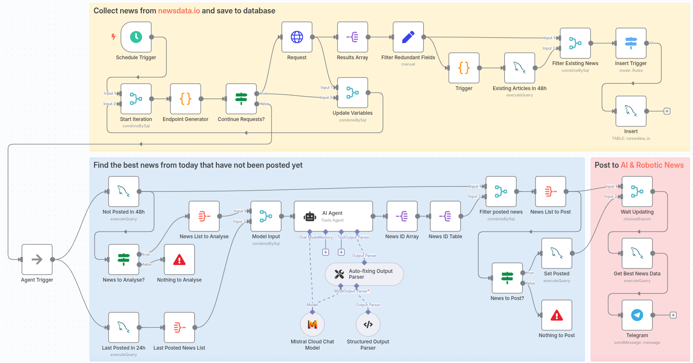

# AI & Robotics Lab News Feed Bot

A **self-hosted, fully automated Telegram bot** that curates and delivers the most interesting, unusual, and high-quality news on Artificial Intelligence (AI) and Robotics directly to the [AI and Robotics Lab Telegram Channel](https://t.me/robotics_ai_news). Built for advanced tech enthusiasts and professionals, the bot collects news from leading sources, applies strict editorial rules, and posts concise updates every few hours—all with zero code required, thanks to n8n automation.

## Features
- **Multi-source Aggregation**: Gathers news from multiple sources globally via [newsdata.io](https://newsdata.io/).
- **AI-Powered Editorial Selection**: Uses a Large Language Model (LLM, Mistral) to select the 5 most relevant and unique articles on AI and robotics every 2 hours.
- **Strict Editorial Filtering**: Filters out irrelevant, purely scientific, product/finance, entertainment, or PR news; focuses on real-world, diverse, impactful developments.
- **Unusual & Fun Picks**: Includes up to one "funny" or odd story per cycle to keep the feed engaging.
- **Fully Automated Telegram Posting**: Publishes summaries with links to the Telegram channel using Markdown formatting.
- **Multilingual & Multiregional Coverage**: Tracks both English and Russian sources, with a global focus.
- **Zero Code Operation**: Managed via [n8n](https://n8n.io/) workflows—**no coding required** for daily operation.
---
## Architecture Overview
| Component             | Description                                   |
|-----------------------|-----------------------------------------------|
| **n8n (Docker)**      | Orchestrates all automation workflows         |
| **MySQL Database**    | Stores and de-duplicates news articles        |
| **newsdata.io API**   | Main source for global news aggregation       |
| **Mistral LLM**       | AI-based selection and logic for top news     |
| **Telegram Bot API**  | Publishes news to the Telegram channel        |
---

**Project workflow**


## Installation
### 1. Prerequisites
- Linux server (Ubuntu recommended)
- Docker and Docker Compose
- SSH access
- Telegram bot token (for posting to your channel and send error messages)
- [newsdata.io](https://newsdata.io/) API key
- [Mistral](https://mistral.ai/) API key

### 2. Remote connection to Linux server with RDP via SSH tunnel

To connect to your remote host with `n8n` via SSH tunnel, you can use Remmina (or any other RDP client) to create a secure connection. RDP (Remote Desktop Protocol) allows you to access the graphical interface of your remote server with its browser to manage and monitor your `n8n` instance.

#### Installing XORG and XRDP on remote host

Use Xfce as a lightweight, compatible desktop:
```sh
sudo apt update && sudo apt upgrade -y
sudo apt install xorg -y
sudo apt install xrdp -y
sudo apt install xfce4 xfce4-goodies -y
echo "startxfce4" > ~/.xsession
sudo systemctl enable xrdp
sudo systemctl start xrdp
```

Reboot and check if your RDP is working:
```sh
sudo systemctl status xrdp
```

#### SSH Tunnel for RDP Connection

On local machine (client)
```sh
ssh -L 3389:localhost:3389 lexmaister@176.123.163.200
```

Then connect to RDP via `localhost:3389`

You can also use Remmina’s built-in SSH tunnel feature instead of manually opening an SSH session in a separate terminal.

How to Use This Feature
* Enable SSH tunnel by checking the box.
* Select "Same server at port 22" if your SSH and RDP run on the same host.
* Enter your authentication details:
  * Set authentication type (SSH identity file for key-based auth, Password if using password login).
  * Username: your SSH username
  * SSH private key file: path to your key (e.g., ~/.ssh/id_rsa, or your Ed25519 key)
  * Password to unlock private key: fill if your key is passphrase-protected
* Save and Connect.

Remmina will create the SSH tunnel and then start your secure RDP session automatically.

### 3. Setup n8n (Self-hosted with Docker Compose)
Install Docker and Docker Compose [for n8n](https://docs.n8n.io/hosting/installation/server-setups/docker-compose/#1-install-docker-and-docker-compose):
```sh
# Remove incompatible or out of date Docker implementations if they exist
for pkg in docker.io docker-doc docker-compose docker-compose-v2 podman-docker containerd runc; do sudo apt-get remove $pkg; done
# Install prereq packages
sudo apt-get update
sudo apt-get install ca-certificates curl
# Download the repo signing key
sudo install -m 0755 -d /etc/apt/keyrings
sudo curl -fsSL https://download.docker.com/linux/ubuntu/gpg -o /etc/apt/keyrings/docker.asc
sudo chmod a+r /etc/apt/keyrings/docker.asc
# Configure the repository
echo "deb [arch=$(dpkg --print-architecture) signed-by=/etc/apt/keyrings/docker.asc] https://download.docker.com/linux/ubuntu $(. /etc/os-release && echo "${UBUNTU_CODENAME:-$VERSION_CODENAME}") stable" | sudo tee /etc/apt/sources.list.d/docker.list > /dev/null

# Update and install Docker and Docker Compose
sudo apt-get update
sudo apt-get install docker-ce docker-ce-cli containerd.io docker-buildx-plugin docker-compose-plugin
```

Clone project directory and create data storage:
```sh
git clone https://github.com/lexmaister/ai_robotics_news_bot.git
cd ai_robotics_news_bot
mkdir -p ./data/n8n ./data/mysql
```

Copy `n8n_mysql-compose.yaml` to `docker-compose.yaml` (included in the repo):
```sh
cp n8n_mysql-compose.yaml docker-compose.yaml
```
and set passwords for Mysql `root` and `n8n_user` in `docker-compose.yaml` that will be used by n8n.

Start containers:
```sh
docker compose up -d
```

Check containers are running:
```sh
docker ps
```

### 4. Setup MySQL Database

Connect to the Mysql container as admin:
```sh
docker exec -it n8n-mysql-1 mysql -u root -p
```

Show databases:
```sql
SHOW DATABASES; 
```

There should be `n8n_news` in the list.

Grant priviledges to `n8n_user`:
```sql
GRANT ALL PRIVILEGES ON n8n_news.* TO 'n8n_user'@'%';
FLUSH PRIVILEGES;
```

Connect to the Mysql as user `n8n_user` to `n8n_news`:
```sh
docker exec -it n8n-mysql-1 mysql -u n8n_user -p n8n_news
```

Create table for newsdata.io news:
```sql
CREATE TABLE newsdata_io (
    id INT UNSIGNED AUTO_INCREMENT PRIMARY KEY,
    article_id VARCHAR(64) NOT NULL,
    title VARCHAR(512) NOT NULL,
    description TEXT,
    link VARCHAR(1024) NOT NULL,
    source_priority INT,
    category JSON,
    pub_dt DATETIME NOT NULL,
    posted BOOLEAN NOT NULL DEFAULT 0
) ENGINE=InnoDB DEFAULT CHARSET=utf8mb4 COLLATE=utf8mb4_unicode_ci;

SHOW TABLES;
```

Output should be like:
```
+--------------------+
| Tables_in_n8n_news |
+--------------------+
| newsdata_io        |
+--------------------+
```

### 5. Import & Configure n8n Workflows

* Open `http://localhost:5678` and log into n8n.
* Create two blank workflows, then import JSON files (`newsdata_io.json`, `error_handler.json`) from `./workflows/`.
* Connect Credentials:
  * `Query Auth` for newsdata.io API key
  * `MySQL` DB credentials (hostname: `mysql`)
  * `Mistral` API key (for LLM)
  * `Telegram` Bot API key

Set workflows' settings as follows:
* Error Workflow: link `error_handler`
* Timezone: your local/operation timezone
* Executions Saving: Off or minimal, for performance

Test `newsdata_io` workflow manually, then activate for full automation.

## License
This project is licensed under the MIT License. See the [LICENSE](./LICENSE) file for details.


<!-- ## Import and run workflows

Main workflow: `newsdata_io.json`.
Error workflow: `error_handler.json`

Create blank workflows, import files, then rename your workflows and setup their settings:
* `error_handler`:
  * Error Workflow - `error_handler`
  * Timezone
* `newsdata_io`:
  * Error Workflow - `error_handler`
  * Timezone
  * Executions saving

Create (use existing) credentials:
* `error_handler`
  * error chat API code
* `newsdata_io`:
  * `Query Auth` for newsdata.io, use name = `apikey`
  * `n8n_news` database (from compose file) - use host = `mysql`
  * `Mistral API` key

Test workflow `newsdata_io` manually, then activate both workflows. -->